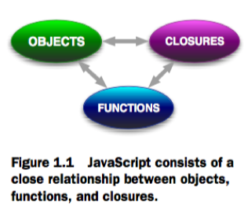

## 1. Enter the ninja.md
* There's nothing simple about creating effective and cross-browser JavaScript code
* Challenges of writing clean code, dealing with obtuse browser differences and complexities
* To deal with these challenges, JavaScript developers frequently capture sets of common and reusable functionality in the form of JavaScript libraries

## 1.1 The JavaScript libraries we'll be tapping
* jQuery - popularized the use of CSS selectors to match DOM content. It provides DOM manipulation, Ajax, event handling, and animation functionality
* Prototype - this library embodies DOM, Ajax, and event functionality, in addition to object-oriented, aspect-oriented, and functional programming techniques
* Yahoo! UI
* base2

* The makeup of a JavaScript library can be broken down in to 3 aspects
    * Advanced use of the JavaScript language
    * Meticulous construction of cross-browser code
    * The use of current best practices that tie everything together

## 1.2 Understanding the JavaScript language


* JavaScript consists of a close relationship between objects, functions, and closures
* Timers and regular expressions

## 1.3 Cross-browser considerations
* 3 primary considerations
    * The expectations and needs of the target audience
    * The market share of the browser
    * The amount of effort necessary to support the browser
* The cost of cross-browser development can depend significantly on the skill and experience of the developers

## 1.4 Current best practices
* Testing
* Performance analysis
* Debugging skills

## 1.4.1 Current best practices: testing
* Primary tool that we'll be using for testing is an `assert()` function, whose purpose is to assert that a premise is either true or false
```
assert(condition, message);
```
* Where the first parameter is a condition that should be true
* The second is a message that will be displayed if it's not

## 1.4.2 Current best practice: performance analysis
* Using code such as the following later for collecting performance information
```
start = new Date().getTime();

for (var n = 0; n < maxCount; n++) {
    // perform the operation to be measured
}
elapsed = new Date().getTime() - start;
assert(true, "Measure time: " + elapsed);
```

## 1.5 Summary
* Cross-browser web application development is hard, harder than most people would think
* In order to pull it off, we need not only a mastery of the JavaScript language, but a thorough knowledge of the browsers, along with their quirks and inconsistencies, and a good grounding in standard current best practices
* While JavaScript development can certainly be challenging, there are those brave souls who have already gone down this tortuous route: the developers of JavaScript libraries