# 1. Grammar

## 1.1 Whitespace
* Formatting characters or comments
* Occasionally necessary to use whitespace to separate sequences of characters that would otherwise be combined into a single token
```
var that = this; // space between var and that connot be removed
```

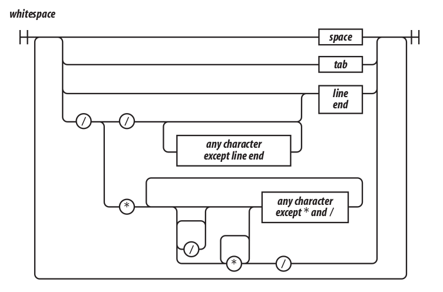

* Recommended to avoid `/* */` and use `//` instead
```
/*
    var rm_a = /a*/.match(s); // error regular expression with block comments
*/
```

## 1.2 Names
* Letter optionally followed by one or more letters, digits, or underscore
* Cannot be on of these reserved words
```
abstract
boolean break byte
case catch char class const continue
debugger default delete do double
else enum export extends
false final finally float for function
goto
if implements import in instanceof int interface
long
native new null
package private protected public
return
short static super switch synchronized
this throw throws transient true try typeof
var volatile void
while with
```

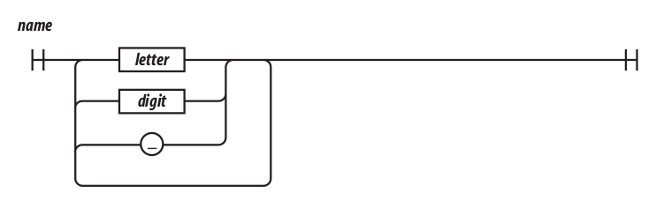

* Name are used for statements, variables, parameters, property names, operators and labels

## 1.3 Numbers

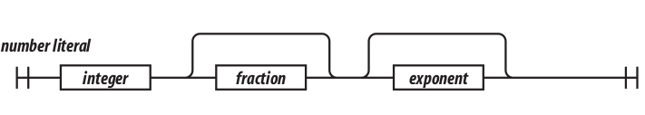

* Represented as 64-bit floating point, same as Java's *double*
* No separate integer type, 1 and 1.0 are the same value

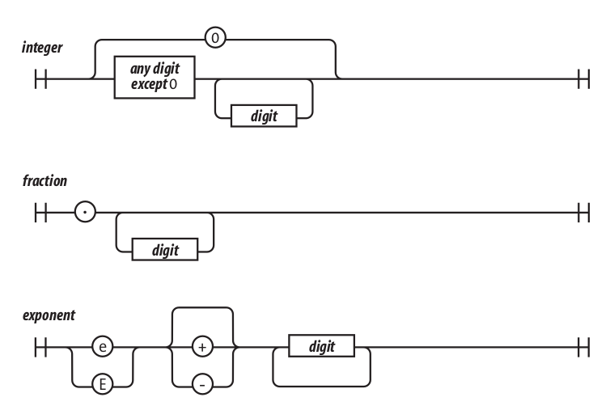

* If a number literal has an exponent part, then the value of the literal is computed by multiplying the part before the `e` by 10 raised to the power of the part after the `e`
```
100 === 1e2
```

* NaN is a number that is the result of an operation that cannot product a normal result
* NaN is not equal to any value, including itself
* Detect NaN with `isNaN(number)` function

* The value `Infinity` represents all values greater than 1.79769313486231570e+308

## 1.4 Strings
* String literal can be wrapped in single quotes or double quotes
* It can contain zero or more characters
* The \ (backslash) is the escape character
* All characters are 16 bits wide
* JavaScript does not have a character type. To represent a character, make a string with just one character in it

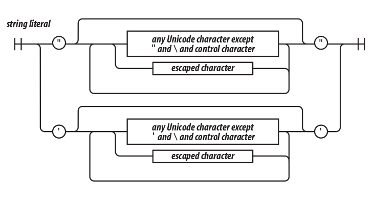

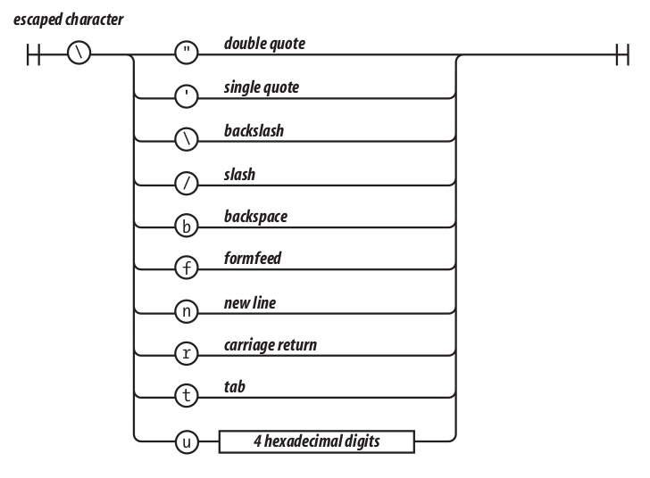

* Strings have a *length* property
* Strings are immutable. Once it is made, a string can never be changed
* Make new string by concatenating other strings together with the + operator

## 1.5 Statements

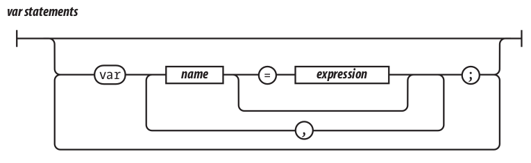

* A compilation unit contains a set of executable statements

* Statements tend to be executed in order from top to bottom
* The sequence of execution can be altered by the conditional statements (`if` and `switch`), by looping statements (`while`, `for`, and `do`), by the disruptive statements (`break`, `return`, and `throw`), and by function invocation

* A block is a set of statements wrapped in curly braces.
* Blocks in JavaScript do not create a new scope, so variables should be defined at the top of the function, not in blocks

* The `if` statement changes the flow of the program based on the value of expression
* The `then` block is executed if the expression is *truthy*; otherwise, the optional `else` branch is taken

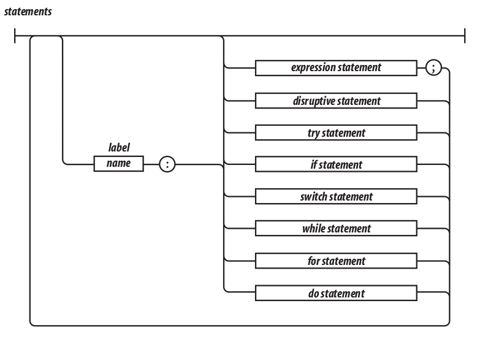

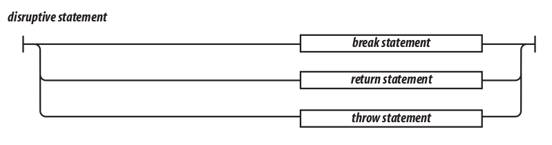

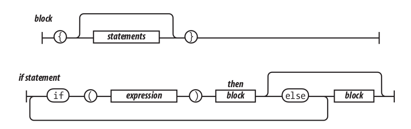

* `falsy` values:
    * false
    * null
    * undefined
    * empty string ''
    * number 0
    * number NaN

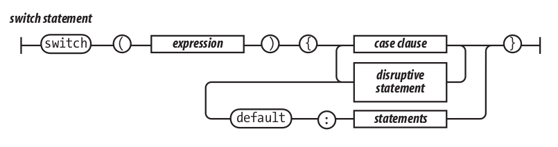

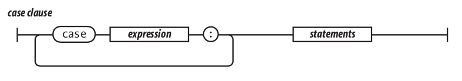


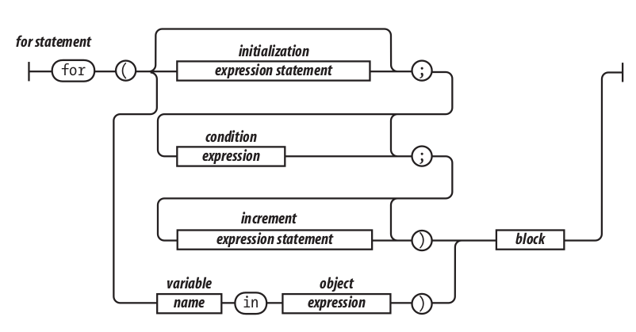

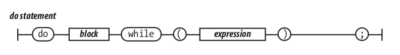

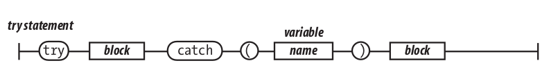

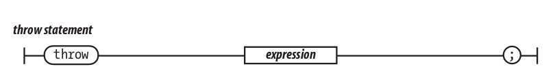

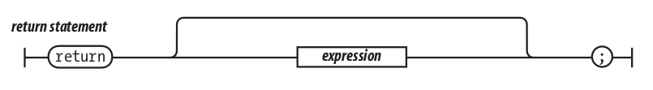

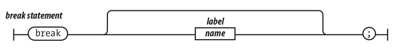

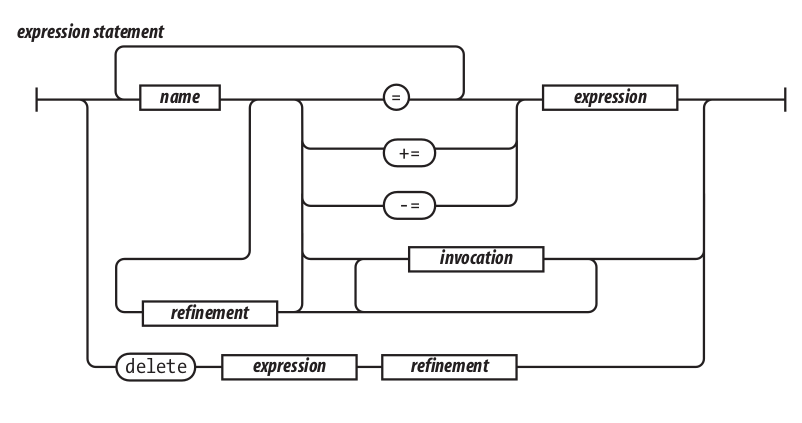

## 1.6 Expressions

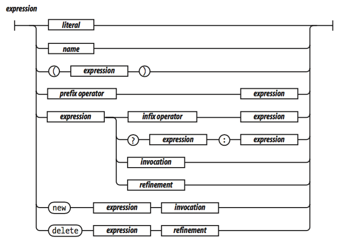

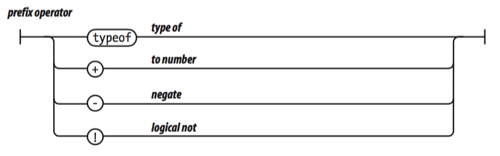

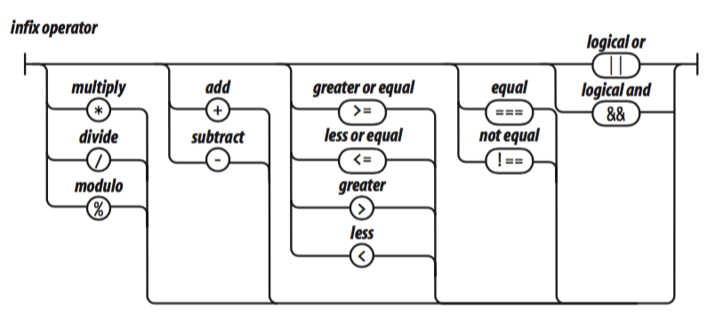

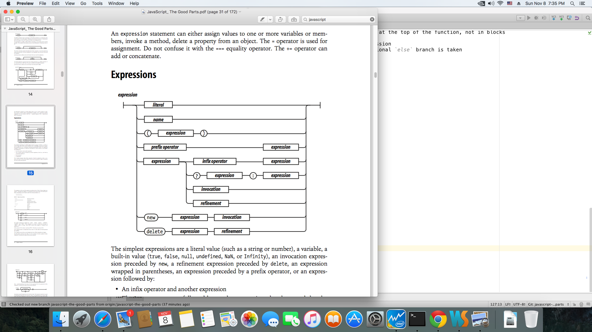

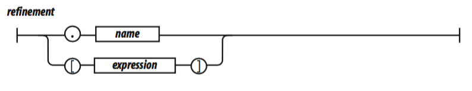

## 1.7 Literals

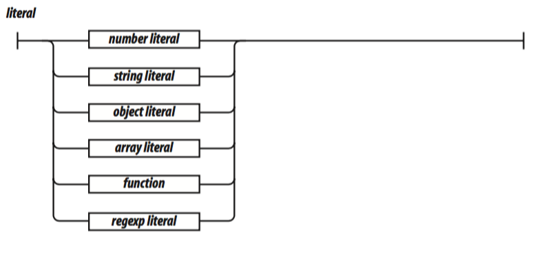

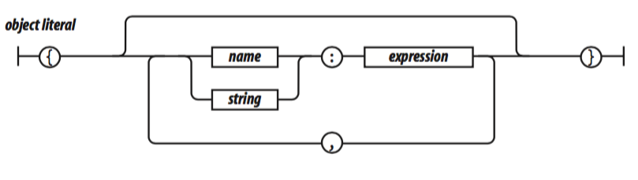

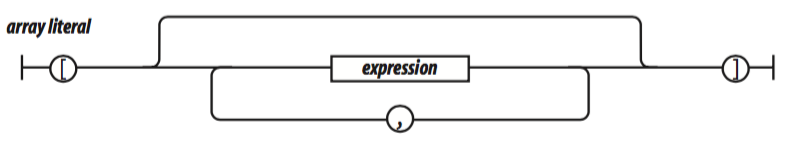

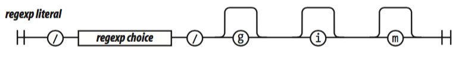

## 1.8 Functions

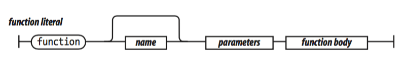

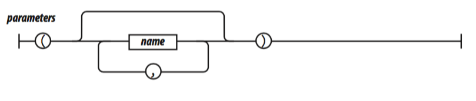

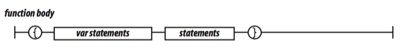